# Blog Sphere

Welcome to the **Blog Sphere** project! This application allows users to create, view, and manage blogs. It is built using **React.js** for the frontend, **Node.js** for the backend, and **MongoDB** for the database.

## Hosted at:
 **[Blog Sphere](https://gblogs.vercel.app)**

## Screenshots
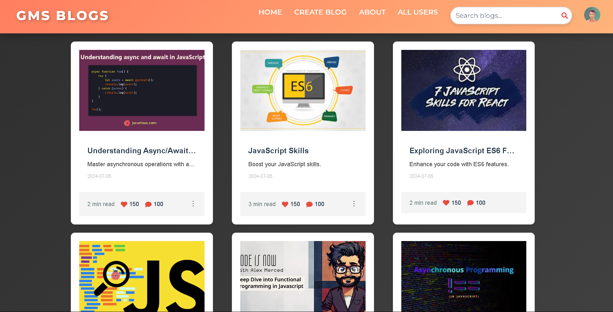 

<details><summary><b>All Pages</b></summary>
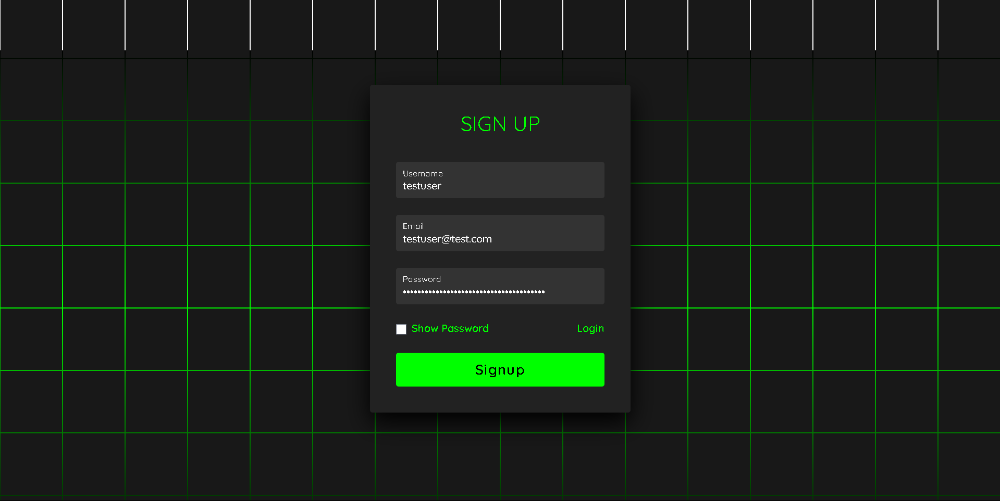
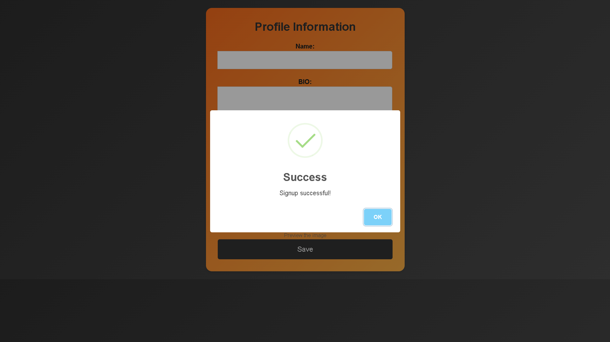
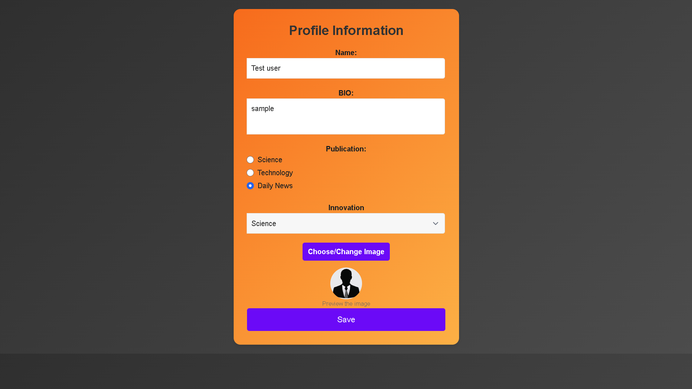
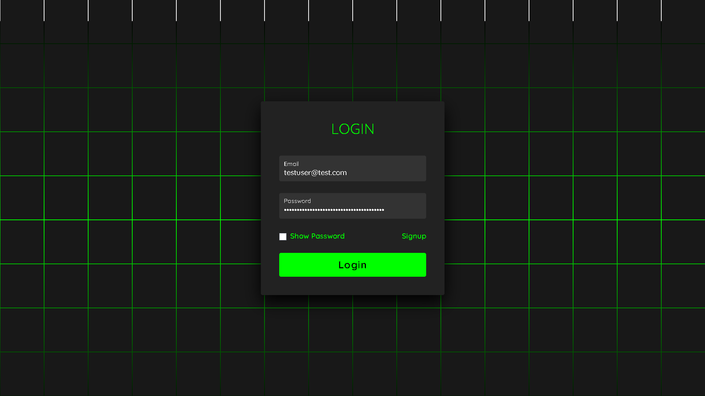
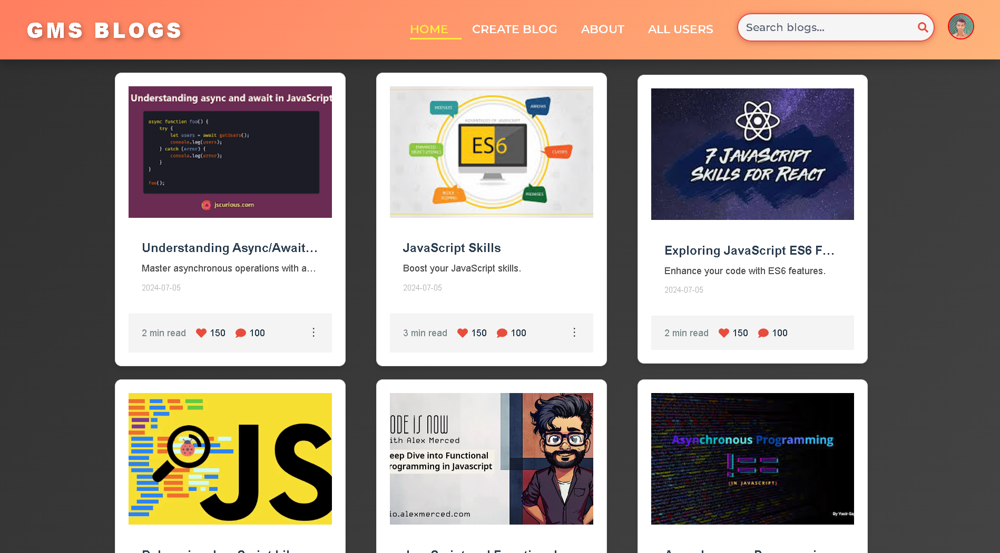
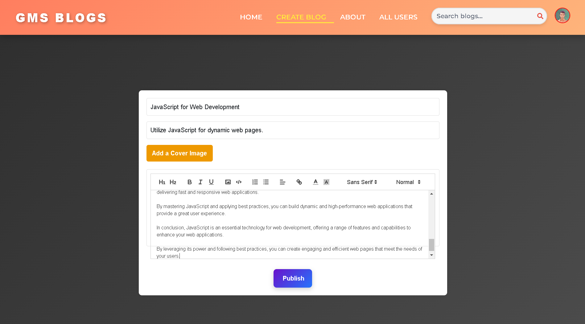
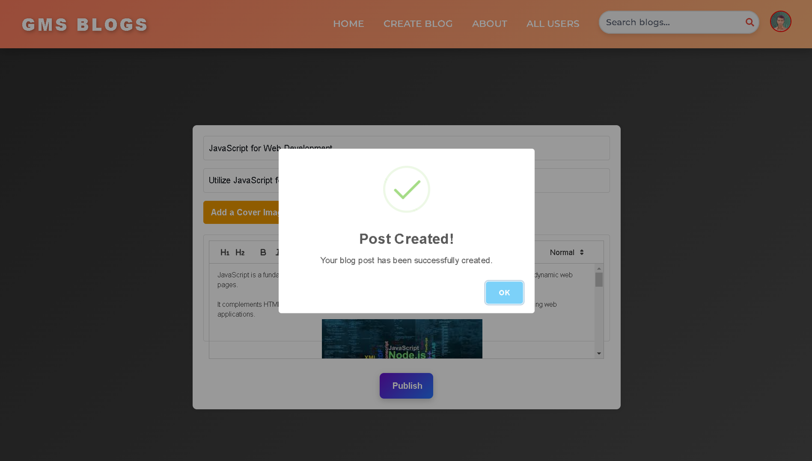
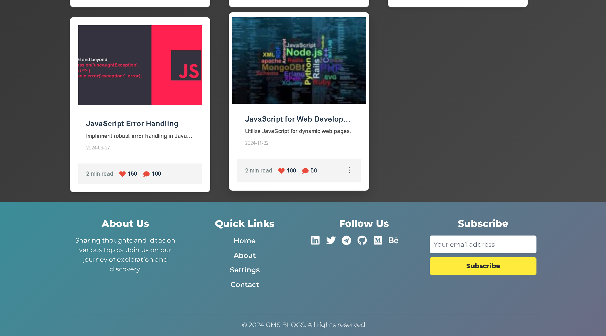
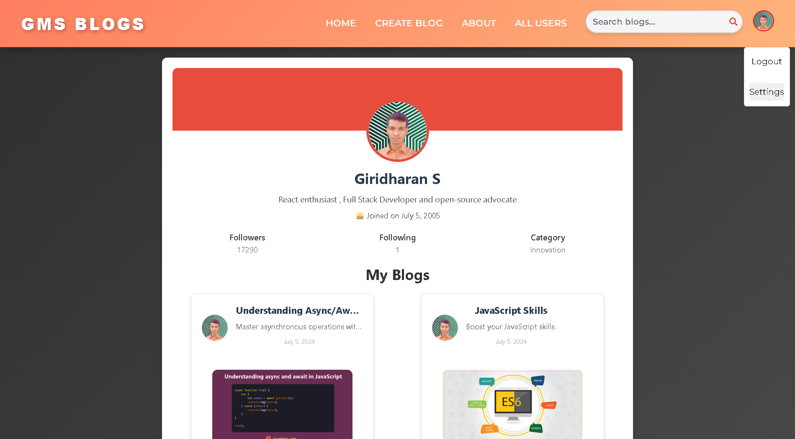
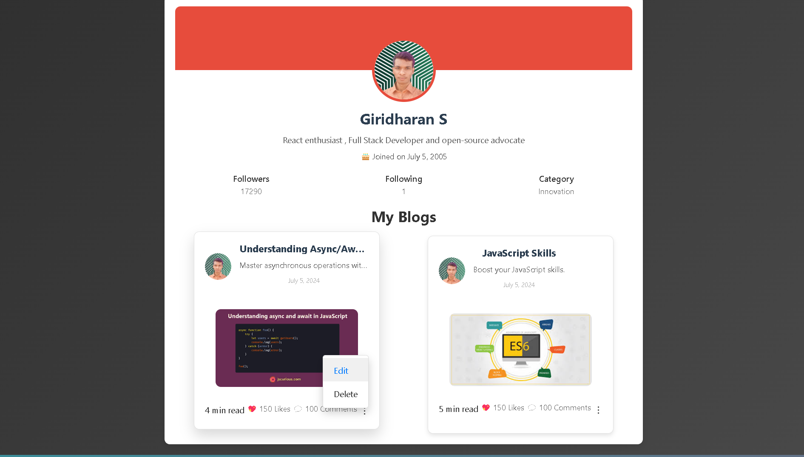
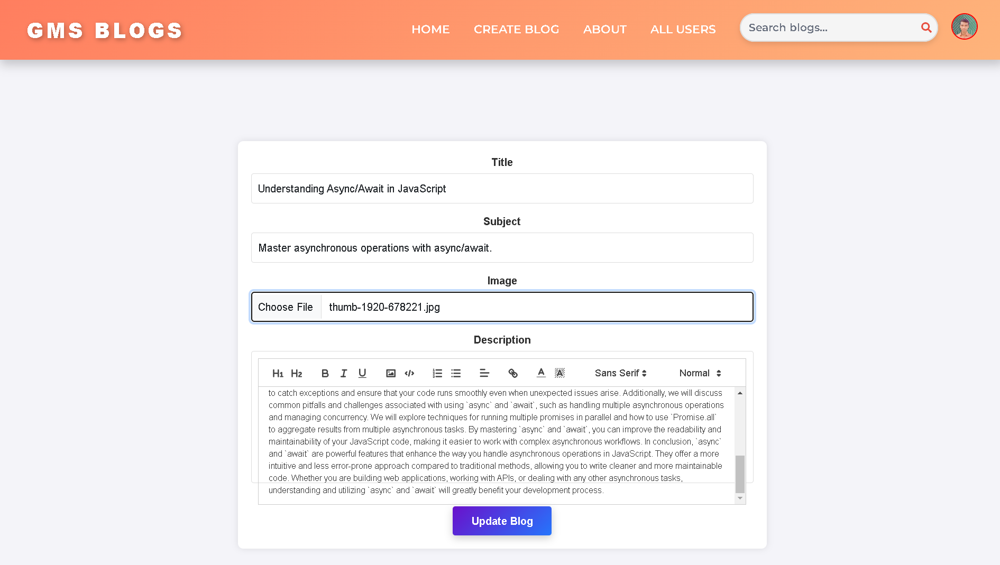
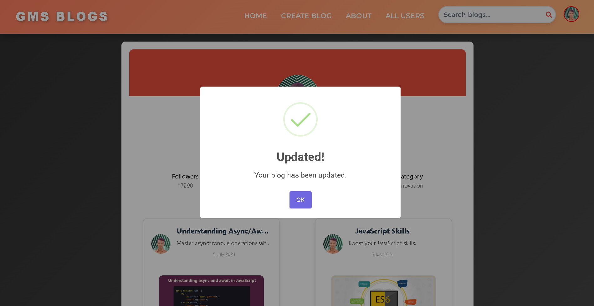
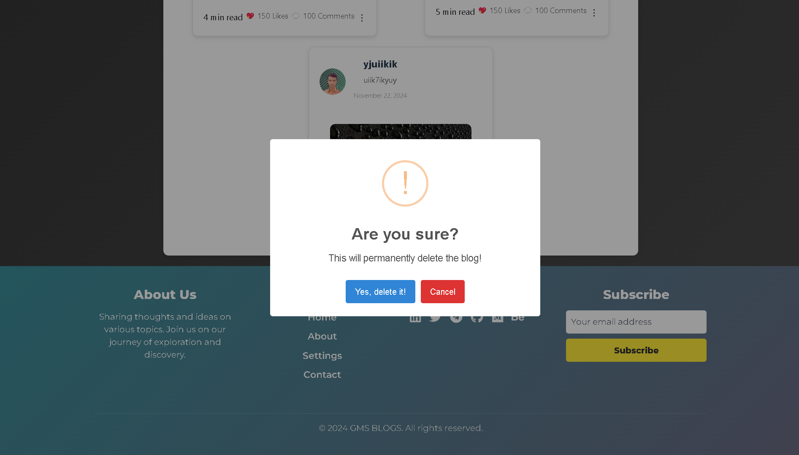
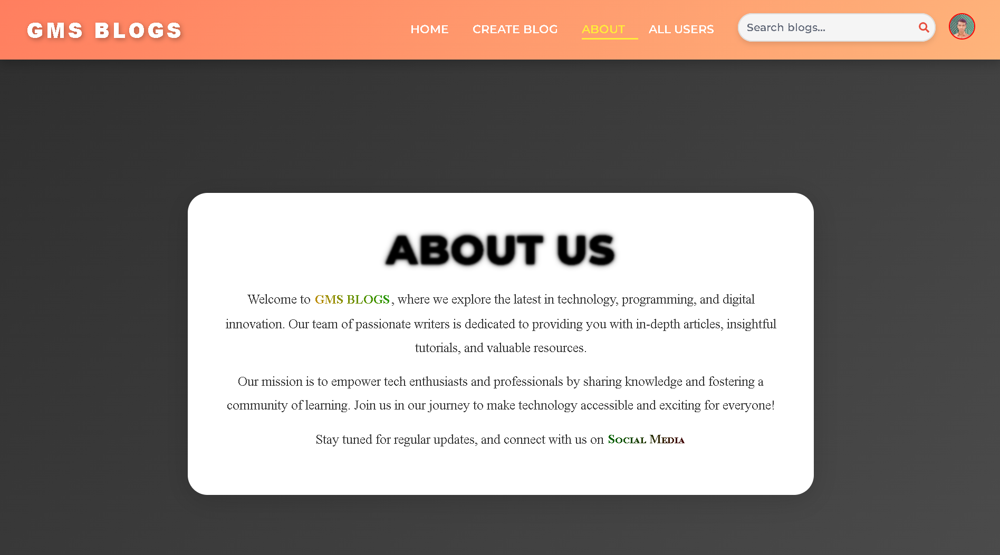
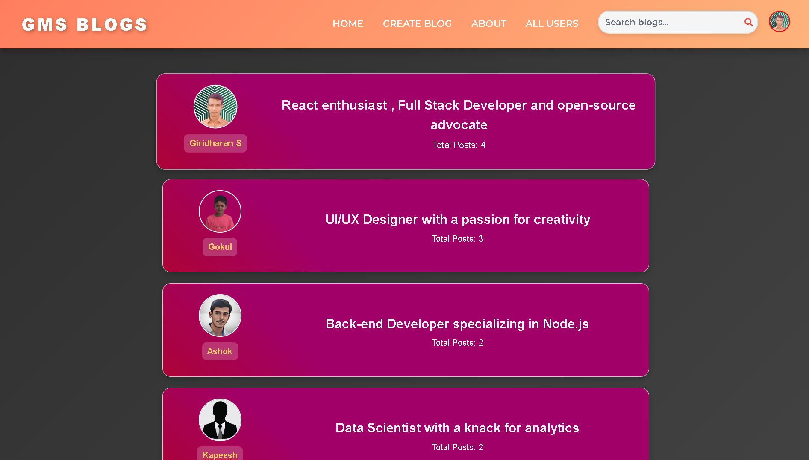

</details>

### 📦 Key Features:
- **Admin Panel**: The **Admin** has full control over the platform, including the ability to:
  - View all **users** through the **All Users** component.
  - Edit, delete, and manage all **posts**.
  - Add, update, or remove blogs from any users.

- **User Panel**: Registered users can:
  - View blogs created by others through the **Blog List** component.
  - Add, edit, and delete only their own blogs.
  - Cannot view or manage blogs created by other users.


## 🛠️ Technologies Used

- **Frontend**: **React.js** 
- **Backend**: **Node.js**, **Express.js**
- **Database**: **MongoDB**

## 🚀 Getting Started

### Prerequisites

Make sure you have the following installed:

- [Node.js](https://nodejs.org/) (v16 or higher)
- [MongoDB](https://www.mongodb.com/try/download/community)

### Installation for Local Machine and Development Environment Setup  

1. **Clone the Repository**

   ```bash
   git clone https://github.com/GiridharanS1729/blogging.git
   cd blogging
   ```

2. **Install Dependencies**

- Frontend:
blogging/
  ```bash
    npm install
  ```

3. **Start the Application**

- Backend:
blogging/server/
  ```bash
    cd server
    npm start
  ```

- Frontend:

  ```bash
  npm start
  ```

### Running the GBlogs Project

To run the GBlogs project using Docker, follow these steps:

1. **Ensure Docker is Installed**  
  Make sure Docker is installed on your system. If not, download and install it from [Docker's official website](https://www.docker.com/get-started).

2. **Pull the Docker Image**  
  If you haven't already pulled the image, you can pull it using the following command:
    ```bash
    docker pull giridharans1729/gblogs:latest
    docker run -p 3000:3000 giridharans1729/gblogs:latest
    ```

### Access the Application

1. **Open ```http://localhost:3000``` in your browser to view the application.**

2. **📝 Usage**

- Add Users: Navigate to the "Users" section to add new user accounts.
- View Users: View user profiles from the "Users" section.
- Delete Users: Remove users from the system by selecting the delete option next to the user profile.
- Add Blogs: Post new blogs via the "Blogs" section.
- View Blogs: Browse and read blogs from the "Blogs" section.
- Delete Blogs: Delete blogs by selecting the delete option next to the blog post.

3. **🛠️ Troubleshooting**

If you encounter issues, ensure that MongoDB is running and that the MONGO_URI in the .env file is correctly set.
Check the terminal for any error messages and address them accordingly.

4. <details><summary><b>📂 Directory Structure</b></summary>
    <pre>
    blogging
    ├── .dockerignore
    ├── .env
    ├── .gitignore
    ├── a.txt
    ├── Dockerfile
    ├── jsonDataFiles
    │   ├── Blogging.blog.json
    │   ├── Blogging.blogs.json
    │   └── Blogging.users.json
    ├── package-lock.json
    ├── package.json
    ├── path.ini
    ├── postcss.config.js
    ├── public
    │   ├── blog.ico
    │   ├── blog.png
    │   ├── data.json
    │   ├── images
    │   │   ├── blogs
    │   │   │   ├── a.jpg
    │   │   │   ├── b.jpg
    │   │   │   ├── c.jpg
    │   │   │   ├── d.jpg
    │   │   │   ├── e.jpg
    │   │   │   ├── f.jpg
    │   │   │   ├── g.jpg
    │   │   │   └── h.jpg
    │   │   ├── folderStructure
    │   │   │   ├── left.png
    │   │   │   └── right.png
    │   │   └── users
    │   │       ├── ashok.png
    │   │       ├── aut.png
    │   │       ├── boy.png
    │   │       ├── elakiya.png
    │   │       ├── girl.png
    │   │       ├── gokul.png
    │   │       ├── mages.png
    │   │       └── sekaran.png
    │   ├── index.html
    │   ├── manifest.json
    │   ├── preview.png
    │   └── robots.txt
    ├── README.md
    ├── server
    │   ├── .env
    │   ├── .gitignore
    │   ├── package.json
    │   ├── ser.js
    │   ├── server.js
    │   └── vercel.json
    ├── src
    │   ├── App.css
    │   ├── App.jsx
    │   ├── App.test.js
    │   ├── components
    │   │   ├── about
    │   │   │   ├── index.jsx
    │   │   │   └── style.css
    │   │   ├── allusers
    │   │   │   ├── index.jsx
    │   │   │   └── user.css
    │   │   ├── BlogActions
    │   │   │   ├── BlogActions.css
    │   │   │   └── index.jsx
    │   │   ├── blogs
    │   │   │   ├── Blogs.css
    │   │   │   └── index.jsx
    │   │   ├── BlogUpdate
    │   │   │   ├── index.jsx
    │   │   │   └── updateBlog.css
    │   │   ├── contact
    │   │   │   ├── cont.css
    │   │   │   └── index.jsx
    │   │   ├── content
    │   │   │   ├── cont.css
    │   │   │   └── index.jsx
    │   │   ├── CreateBlog
    │   │   │   ├── createblog.css
    │   │   │   └── index.jsx
    │   │   ├── CreateUser
    │   │   │   ├── createUser.css
    │   │   │   └── index.jsx
    │   │   ├── footer
    │   │   │   ├── Footer.css
    │   │   │   └── index.jsx
    │   │   ├── home
    │   │   │   └── index.jsx
    │   │   ├── login
    │   │   │   ├── index.jsx
    │   │   │   └── login.css
    │   │   ├── navbar
    │   │   │   ├── index.jsx
    │   │   │   └── Navbar.css
    │   │   ├── settings
    │   │   │   ├── index.jsx
    │   │   │   └── settings.css
    │   │   ├── signup
    │   │   │   ├── index.jsx
    │   │   │   └── signup.css
    │   │   └── users
    │   │       ├── index.jsx
    │   │       └── user.css
    │   ├── config.js
    │   ├── index.css
    │   ├── index.js
    │   ├── logo.png
    │   ├── logo.svg
    │   ├── reportWebVitals.js
    │   ├── setupTests.js
    │   └── utils
    │       ├── pers.js
    │       └── prt.js
    └── tailwind.config.js
    </pre>
</details>
**📄 License**
This project is licensed under the MIT License - see the [LICENSE](LICENSE) file for details.

**🤝 Contributing**
Feel free to submit issues, fork the repository, and make pull requests. Contributions are welcome!

📞 Contact

For any inquiries, please contact [Me](giridharans1729@gmail.com).


 
